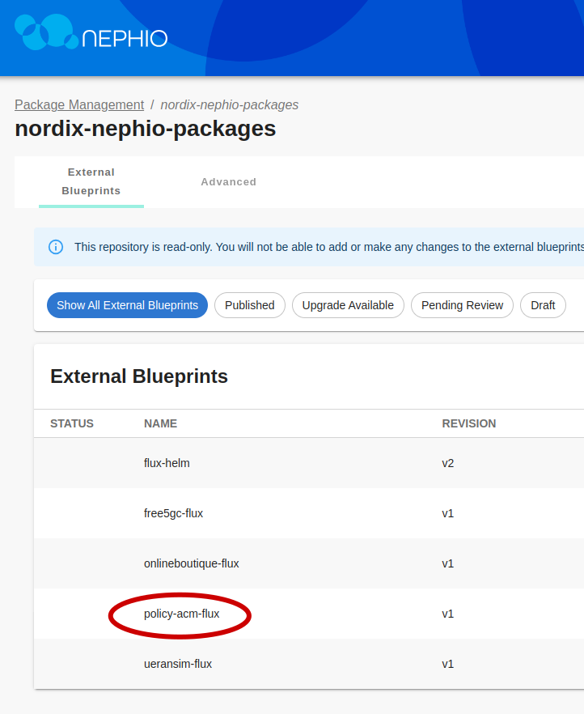
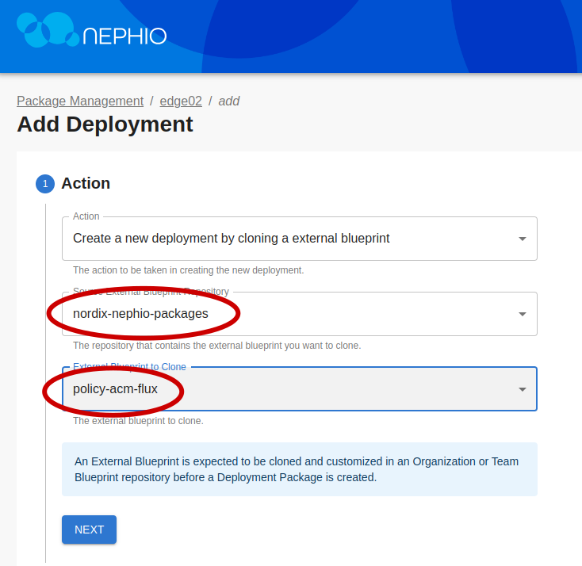

# Deploying helm chart in Nephio using Flux CD

[Flux CD](https://fluxcd.io/flux/use-cases/helm/) provides a set of kubernetes controllers to enable a GitOps driven deployment of helm charts, using relevant the flux Custom Resources.

In this example, we deploy the flux [helm](https://fluxcd.io/flux/components/helm/) and [source](https://fluxcd.io/flux/components/source/) controllers via a kpt package to the target workload cluster.

Then, we can utilize the flux Custom Resources defined in another test kpt package to deploy an example helm chart.

##  Pre requisites:
* [Nephio R1 sandbox](https://github.com/nephio-project/docs/blob/main/install-guide/README.md): Set up the Nephio sandbox environment.
* [Access to the Nephio Web UI](https://github.com/nephio-project/docs/blob/main/install-guide/README.md#access-to-the-user-interfaces)
* [Nephio R1 sandbox workload clusters](https://github.com/nephio-project/docs/blob/main/user-guide/exercises.md#quick-start-exercises): Create/Deploy the predefined set of workload clusters by completing the quick start exercises up to and including [set 3](https://github.com/nephio-project/docs/blob/main/user-guide/exercises.md#step-3-deploy-two-edge-clusters).

### Deploying the flux-helm-controllers pkg

Access the Nephio Web UI and execute the following:

We will deploy the `flux-helm-controllers` pkg from the `nephio-example-packages` 
repo to the `edge02` workload cluster.
* Step 1


* Step 2


* Step 3


Click through the `Next` button until you are through all the steps, 
leaving all options as `default`, then click `Create Deployment`.

* Step 4


At this point, we can take a closer look at the contents of the kpt package which 
contains the relevant kubernetes resources to deploy the controllers.

Note: We are deploying into the `flux-system` namespace by default.

Finally, we need to `propose` and then `approve` the pkg to initialize the deployment.

* Step 5


* Step 6


Shortly thereafter, you should see flux helm and source controllers in the flux-system namespace:

```bash
kubectl get po --context edge02-admin@edge02 -n flux-system
```
<details>
<summary>The output is similar to:</summary>

```console
NAME                                 READY   STATUS    RESTARTS   AGE
helm-controller-cccc87cc-zqnd6       1/1     Running   0          6m20s
source-controller-5756bf7d48-hprkn   1/1     Running   0          6m20s
```
</details>


### Deploying the policy-acm-flux pkg

To make the demo kpt packages available in Nephio, we need to register a new 
`External Blueprints`repository. 
We can do this via kubectl towards the management cluster.

```bash
cat << EOF | kubectl apply -f - 
apiVersion: config.porch.kpt.dev/v1alpha1
kind: Repository
metadata:
  name: nordix-nephio-packages
  namespace: default
  labels:
    kpt.dev/repository-access: read-only
    kpt.dev/repository-content: external-blueprints
spec:
  content: Package
  deployment: false
  git:
    branch: master
    directory: /packages
    repo: https://github.com/Nordix/nordix-nephio-packages.git
  type: git

EOF
```
The new repository should now have been added to the `External Blueprints` section of the UI.


From here, we can see the policy-acm-flux pkg to be deployed.




To deploy the pkg, repeat/follow Steps 1 - 6 from above, 
replacing step 3 with the following. 
Take note of the source repo and the package to be deployed.

**_NOTE:_**  The overrides values.yaml ConfigMap in the package is pre-configured 
to deploy a limited subset of the chart for demo purposes.



Shortly thereafter, you should see the  defined policy acm components in the acm namespace:

```bash
kubectl get po --context edge02-admin@edge02 -n acm
```
<details>
<summary>The output is similar to:</summary>

```console
NAME                                        READY   STATUS      RESTARTS   AGE
mariadb-galera-0                            1/1     Running     0          12m
policy-clamp-runtime-acm-66dc9bd8bb-f99rp   1/1     Running     0          12m
policy-galera-config-tcs5c                  0/1     Completed   0          12m
policy-galera-init-q8d8v                    0/1     Completed   0          12m
policy-models-simulator-7d6d7dcdff-fvrss    1/1     Running     0          12m
```
</details>